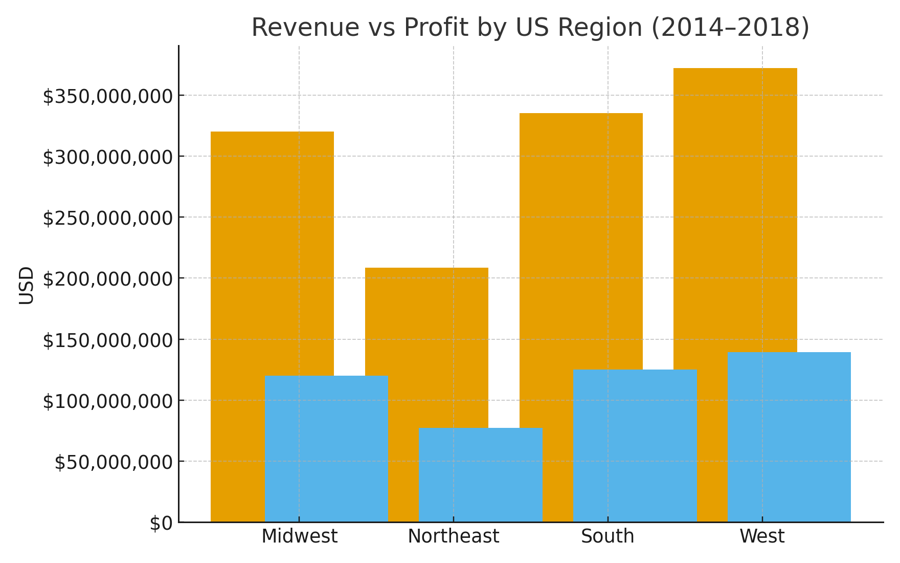

# Regional Sales Summary (2014–2018)




[](https://github.com/<your-username>/regional-sales-summary/blob/main/notebooks/EDA%20on%20Regional%20Sales-2.ipynb)

This project analyses five years of U.S. regional sales data to uncover trends in revenue, profit, and margins.  
It covers performance across **regions, channels, states, and products**, as well as **seasonal patterns** and a **budget vs actuals review** for 2017.  

---

## 📂 Project Structure

```
├── data/
│   └── Regional Sales Dataset.xlsx       # Source dataset (5 years of sales data)
├── notebooks/
│   └── EDA on Regional Sales.ipynb     # Jupyter notebook with exploratory data analysis
├── outputs/
│   ├── charts/                           # Auto-generated charts (PNG)
│   │   ├── by_region_rev_profit.png
│   │   ├── by_channel_rev_profit.png
│   │   ├── profit_by_year.png
│   │   ├── monthly_sales_over_time.png
│   │   ├── seasonality_monthly_revenue.png
│   │   ├── top10_products_by_avg_profit.png
│   │   ├── top10_states_by_profit.png
│   │   ├── 2017_budget_vs_actuals_top_over.png
│   │   ├── 2017_budget_vs_actuals_top_under.png
│   │   ├── yoy_revenue_by_region.png
│   │   └── repo_thumbnail.png
│   └── Regional Sales Summary.pptx       # Presentation deck with insights & recommendations
├── README.md                             # Project documentation
└── requirements.txt                      # Python dependencies
```

---

## 🔍 Key Insights
- The **South** showed the strongest balance of revenue and profitability.  
- The **West** led in revenue but struggled with margins.  
- **Distributor** channel delivered the best profit margins.  
- Strong seasonal spikes in **November–December** and dips in **February–March**.  
- Profit was concentrated in **California, Texas, and New York**, plus a small set of top products.  
- 2017 budget attainment was strong overall, though some products over- or under-performed.  

---

## ✅ Recommendations
- Focus on the **South** region and resolve cost/pricing issues in the **West**.  
- Grow the **Distributor** channel while making Wholesale more efficient.  
- Plan stock, staff, and marketing to make the most of **Q4 peaks**; run promotions in **Q1**.  
- Expand in **California, Texas, and New York**, while piloting growth strategies in mid-sized states.  
- Scale up top-performing products, review underperformers, and use quarterly budget vs actual checks.  

---

## 🚀 Getting Started

1. Clone the repo and set up a virtual environment:
   ```bash
   git clone https://github.com/<your-username>/regional-sales-summary.git
   cd regional-sales-summary
   python -m venv .venv
   source .venv/bin/activate   # on Windows use .venv\Scripts\activate
   pip install -r requirements.txt
   ```

2. Place the dataset in the `data/` folder (if not already included).  

3. Open the notebook:
   ```bash
   jupyter notebook notebooks/EDA\ on\ Regional\ Sales-2.ipynb
   ```

---

## 📊 Deliverables
- **EDA Notebook** → Full analysis with charts and code.  
- **Presentation Deck (PPTX)** → Ready to present with notes and recommendations.  
- **Charts (PNG)** → Exported visuals for reuse in reports or dashboards.  

---

## 🛠️ Requirements
See `requirements.txt` for Python dependencies:  
- pandas  
- numpy  
- matplotlib  
- python-pptx  
- reportlab  

---

## 📜 License
MIT License (or other licence you choose).  
